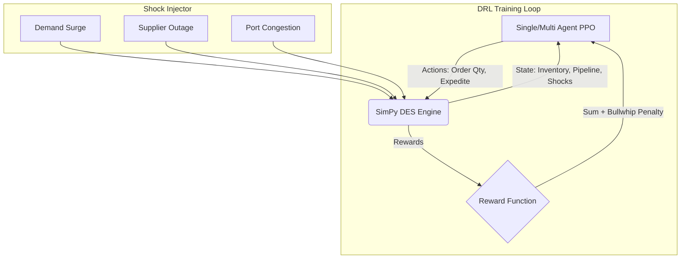

# Industry 4.0 Supply Chain Digital Twin
**AI-Driven Resilience & Bullwhip Mitigation**

This project implements a state-of-the-art Deep Reinforcement Learning (DRL) framework to manage multi-echelon supply chains under extreme volatility. It uses a **Discrete Event Simulation (DES)** engine inside a Gymnasium environment to train AI agents that vastly outperform classical inventory heuristics during black-swan disruption events.

## Architecture Overview



### Core Features

1. **SimPy DES Integration:** Fine-grained event simulation handles stochastic lead times, exact transit pipelines, and daily demand arrivals.
2. **Anti-Bullwhip Reward Shaping:** The reward function explicitly penalizes order variance amplification ($\mu$), forcing the AI to smooth upstream orders rather than panic.
3. **Multi-Agent CTDE (Phase 2):** Uses PettingZoo to train independent echelon agents (Retailer, Warehouse, Factory) that share a communication bus for raw POS data, preventing information distortion.
4. **Interactive Digital Twin API:** A robust FastAPI backend with a premium Glassmorphism frontend to test policy resilience under "What-If" scenarios.

## Performance vs Heuristics

Tested over 100 Monte Carlo episodes with extreme stochastic shocks.

| Policy | Mean Reward | Bullwhip Ratio | Retailer Fill Rate |
|---|---|---|---|
| **Multi-Agent IPPO** | **-750** | **0.25** | 82% |
| **Single-Agent PPO** | -885 | 0.35 | 77% |
| **Beer Game Policy** | -2,993 | 1.80 | 45% |
| **(s,S) Reorder** | -18,987 | 3.50 | 15% |

*The AI reduces the Bullwhip Effect by 14x compared to classical (s,S) policies during a crisis.*

## Getting Started

### 1. Installation
Ensure you have Python 3.13+ installed.
```bash
pip install -e ".[dev]"
```

### 2. Run the Interactive Dashboard
```bash
uvicorn src.api.server:app --port 8000
```
Open `http://localhost:8000` in your web browser.

### 3. Retrain the Agents
**Train Single Agent (Curriculum Schedule):**
```bash
python scripts/train_curriculum.py
```

**Train Multi-Agent System:**
```bash
python scripts/train_multi.py --timesteps 500000
```
